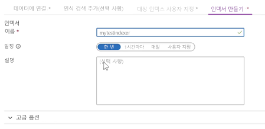

# <a name="demo-1---azure-cognitive-search"></a>Demostración 1: Azure Cognitive Search

[](https://globaleventcdn.blob.core.windows.net/assets/aiml/aiml10/videos/Demo1.mp4 "Demostración 1")

## <a name="summary"></a>Resumen
En este ejercicio se muestran las funciones básicas de Azure Cognitive Search junto con el conjunto de aptitudes inteligente integrado. Hay varias formas de crear los recursos necesarios para esta demostración:
1. Siga con el vídeo anterior (se describe cada paso).
2. También puede usar la [CLI de Azure](https://docs.microsoft.com/en-us/cli/azure/install-azure-cli?view=azure-cli-latest&WT.mc_id=msignitethetour2019-github-aiml10).


## <a name="what-you-need"></a>Qué se necesita
- [Conjunto de prueba de facturas](https://globaleventcdn.blob.core.windows.net/assets/aiml/aiml10/data/test.zip)

## <a name="azure-resources"></a>Recursos de Azure
Estos son los recursos que se crearon en la primera demostración. Aunque en esta tabla se describen los nombres de los recursos tal como se muestran en el vídeo, use sus propios nombres para cada uno de los recursos.


| Nombre                       | Tipo                            | Propósito                    |
| -------------------------- | ------------------------------- | ------------------------- |
| **ttcognitivesearch**     | Grupo de recursos                  | Agrupa los servicios   |
| **ttinvoicestorage**      | Cuenta de almacenamiento                 | Se usa para almacenar las facturas     |
| **ttinvoicesearch**       | Servicio Search                  | Servicio destacado           |
| **ttinvoiceintelligence** | Cognitive Services (Todo en uno) | Se usa en el servicio Search |


## <a name="what-to-do"></a>Qué debe hacer

Los pasos principales son tres:
1. Creación de un grupo de recursos
2. Creación y uso de una cuenta de almacenamiento
3. Creación y uso de un recurso del servicio Search


### <a name="create-a-resource-group"></a>Creación de un grupo de recursos
Todos los recursos residirán en este grupo.

```
az group create --location {LOCATION} --name {YOUR_RG_NAME}
```

### <a name="create-and-use-storage-account"></a>Creación y uso de una cuenta de almacenamiento
La cuenta de almacenamiento se usa principalmente para almacenar las facturas.

1. Cree una cuenta de almacenamiento.

```
az storage account create --name {YOUR_STORAGE_NAME} --location {LOCATION} --resource-group {YOUR_RG_NAME} --sku Standard_LRS
```

2. Cree un contenedor denominado `test`.

[](https://docs.microsoft.com/en-us/azure/storage/blobs/storage-quickstart-blobs-portal?WT.mc_id=msignitethetour2019-github-aiml10 "Creación de un contenedor")

3. Descargue y descomprima el [conjunto de prueba de facturas](https://globaleventcdn.blob.core.windows.net/assets/aiml/aiml10/data/test.zip).

4. Cargue el [conjunto de prueba de facturas](https://globaleventcdn.blob.core.windows.net/assets/aiml/aiml10/data/test.zip) descomprimido en el contenedor `test`. Puede realizarlo directamente mediante el [portal](https://docs.microsoft.com/en-us/azure/storage/blobs/storage-quickstart-blobs-portal?WT.mc_id=msignitethetour2019-github-aiml10#upload-a-block-blob) o mediante la aplicación [Explorador de Azure Storage](https://docs.microsoft.com/en-us/azure/vs-azure-tools-storage-explorer-blobs?WT.mc_id=msignitethetour2019-github-aiml10) (como se muestra en el [vídeo](https://globaleventcdn.blob.core.windows.net/assets/aiml/aiml10/videos/Demo1.mp4 "Demostración 1")).

### <a name="create-and-use-a-search-service-resource"></a>Creación y uso de un recurso del servicio Search
Cree una instancia del servicio Search:

[](https://docs.microsoft.com/en-us/azure/search/search-create-service-portal?WT.mc_id=msignitethetour2019-github-aiml10 "Azure Search")


Use el servicio Search:

1. En el servicio recién creado, haga clic en `Import Data`.

[](https://docs.microsoft.com/en-us/azure/search/cognitive-search-quickstart-blob?WT.mc_id=msignitethetour2019-github-aiml10#create-the-enrichment-pipeline "Importación de datos")

2. Use una conexión existente al contenedor `test` que se creó en la cuenta de almacenamiento.

[](https://docs.microsoft.com/en-us/azure/search/cognitive-search-quickstart-blob?WT.mc_id=msignitethetour2019-github-aiml10#step-1-create-a-data-source "Importación de datos")

3. Cree un recurso de Cognitive Services.

[](https://docs.microsoft.com/en-us/azure/search/cognitive-search-quickstart-blob?WT.mc_id=msignitethetour2019-github-aiml10#step-2-add-cognitive-skills "Creación de Cognitive Services")

4. Vuelva al asistente y haga clic en el botón pertinente para actualizar el contenido. Debería ver el servicio recién creado. 

5. Ahora puede agregar los enriquecimientos que quiera.

[](https://docs.microsoft.com/en-us/azure/search/cognitive-search-quickstart-blob?WT.mc_id=msignitethetour2019-github-aiml10#step-2-add-cognitive-skills "Incorporación de enriquecimientos")

6. Después de hacer clic en `Customize Target Index`, revise el índice propuesto y haga clic en `Create and Indexer`.

[](https://docs.microsoft.com/en-us/azure/search/cognitive-search-quickstart-blob?WT.mc_id=msignitethetour2019-github-aiml10#step-3-configure-the-index "Primer índice")

7. Asigne un nombre al nuevo indizador y haga clic en `Submit`.

[](https://docs.microsoft.com/en-us/azure/search/cognitive-search-quickstart-blob?WT.mc_id=msignitethetour2019-github-aiml10#step-4-configure-the-indexer "Primer indizador")

8. Cuando se haya realizado la indexación, cree algunas consultas:

[](https://docs.microsoft.com/en-us/azure/search/cognitive-search-quickstart-blob?WT.mc_id=msignitethetour2019-github-aiml10#query-in-search-explorer "Primera búsqueda")

# <a name="next-demo"></a>Siguiente demostración
Prosiga con la [Demostración 2: Uso de Form Recognizer](demo2.md) para aprender a usar el servicio cognitivo Form Recognizer.