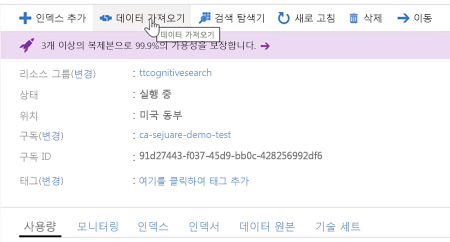
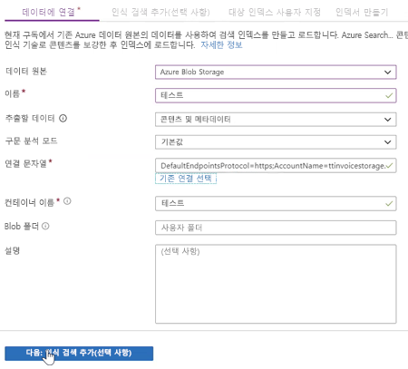
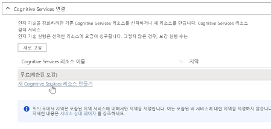
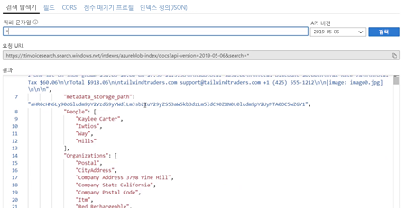

# <a name="demo-1---azure-cognitive-search"></a>데모 1 - Azure Cognitive Search

[](https://globaleventcdn.blob.core.windows.net/assets/aiml/aiml10/videos/Demo1.mp4 "데모 1")

## <a name="summary"></a>요약
이 연습에서는 기본 제공 인텔리전트 기술 세트와 함께 Azure Cognitive Search의 기본 기능을 설명합니다. 이 데모에 필요한 리소스를 만드는 방법에는 여러 가지가 있습니다.
1. 위의 동영상을 따라 하거나(단계별로 설명됨)
2. [Azure CLI](https://docs.microsoft.com/en-us/cli/azure/install-azure-cli?view=azure-cli-latest&WT.mc_id=msignitethetour2019-github-aiml10) 사용


## <a name="what-you-need"></a>필요한 항목
- [청구서 테스트 세트](https://globaleventcdn.blob.core.windows.net/assets/aiml/aiml10/data/test.zip)

## <a name="azure-resources"></a>Azure 리소스
첫 번째 데모에서 만든 리소스입니다. 이 표에서는 동영상에 표시된 리소스의 이름을 간략하게 설명하지만 각 리소스에 고유 이름을 사용하세요.


| 이름                       | 형식                            | 용도                    |
| -------------------------- | ------------------------------- | ------------------------- |
| **ttcognitivesearch**     | 리소스 그룹                  | 서비스를 함께 그룹화합니다.   |
| **ttinvoicestorage**      | 스토리지 계정                 | 청구서를 저장하는 데 사용     |
| **ttinvoicesearch**       | Search Service                  | 추천 서비스           |
| **ttinvoiceintelligence** | Cognitive Services (올인원) | Search Service에 사용됩니다. |


## <a name="what-to-do"></a>수행할 작업

세 가지 주요 단계가 있습니다.
1. 리소스 그룹 만들기
2. 스토리지 계정 만들기 및 사용
3. Search Service 리소스 만들기 및 사용


### <a name="create-a-resource-group"></a>리소스 그룹 만들기
모든 리소스는 이 그룹에 있습니다.

```
az group create --location {LOCATION} --name {YOUR_RG_NAME}
```

### <a name="create-and-use-storage-account"></a>스토리지 계정 만들기 및 사용
스토리지 계정은 주로 청구서를 저장하는 데 사용됩니다.

1. 스토리지 계정 만들기

```
az storage account create --name {YOUR_STORAGE_NAME} --location {LOCATION} --resource-group {YOUR_RG_NAME} --sku Standard_LRS
```

2. `test`라는 컨테이너 만들기

[](https://docs.microsoft.com/en-us/azure/storage/blobs/storage-quickstart-blobs-portal?WT.mc_id=msignitethetour2019-github-aiml10 "컨테이너 만들기")

3. [청구서 테스트 세트](https://globaleventcdn.blob.core.windows.net/assets/aiml/aiml10/data/test.zip)를 다운로드하고 압축을 풉니다.

4. 압축을 푼 [청구서 테스트 세트](https://globaleventcdn.blob.core.windows.net/assets/aiml/aiml10/data/test.zip)를 `test` 컨테이너에 업로드합니다. [포털](https://docs.microsoft.com/en-us/azure/storage/blobs/storage-quickstart-blobs-portal?WT.mc_id=msignitethetour2019-github-aiml10#upload-a-block-blob)을 사용하거나 [Azure Storage Explorer](https://docs.microsoft.com/en-us/azure/vs-azure-tools-storage-explorer-blobs?WT.mc_id=msignitethetour2019-github-aiml10) 애플리케이션을 사용하여 직접 수행할 수 있습니다([동영상](https://globaleventcdn.blob.core.windows.net/assets/aiml/aiml10/videos/Demo1.mp4 "데모 1")에 표시됨).

### <a name="create-and-use-a-search-service-resource"></a>Search Service 리소스 만들기 및 사용
검색 서비스 만들기:

[](https://docs.microsoft.com/en-us/azure/search/search-create-service-portal?WT.mc_id=msignitethetour2019-github-aiml10 "Azure Search")


Search Service:사용:

1. 새로 만든 서비스에서 `Import Data`를 클릭합니다.

[](https://docs.microsoft.com/en-us/azure/search/cognitive-search-quickstart-blob?WT.mc_id=msignitethetour2019-github-aiml10#create-the-enrichment-pipeline "데이터 가져오기")

2. 스토리지 계정에서 만든 `test` 컨테이너에 대한 기존 연결을 사용합니다.

[](https://docs.microsoft.com/en-us/azure/search/cognitive-search-quickstart-blob?WT.mc_id=msignitethetour2019-github-aiml10#step-1-create-a-data-source "데이터 가져오기")

3. 새 Cognitive Services 리소스 만들기

[](https://docs.microsoft.com/en-us/azure/search/cognitive-search-quickstart-blob?WT.mc_id=msignitethetour2019-github-aiml10#step-2-add-cognitive-skills "Cognitive Services 만들기")

4. 마법사로 돌아가서 새로 고침을 누릅니다. 새로 만든 서비스가 표시됩니다. 

5. 이제 원하는 모든 보강을 추가할 수 있습니다.

[](https://docs.microsoft.com/en-us/azure/search/cognitive-search-quickstart-blob?WT.mc_id=msignitethetour2019-github-aiml10#step-2-add-cognitive-skills "보강 추가")

6. `Customize Target Index`를 클릭한 후 제안된 인덱스를 검토하고 `Create and Indexer`를 클릭합니다.

[](https://docs.microsoft.com/en-us/azure/search/cognitive-search-quickstart-blob?WT.mc_id=msignitethetour2019-github-aiml10#step-3-configure-the-index "첫 번째 인덱스")

7. 새 인덱서에 이름을 지정하고 `Submit`을 클릭합니다.

[](https://docs.microsoft.com/en-us/azure/search/cognitive-search-quickstart-blob?WT.mc_id=msignitethetour2019-github-aiml10#step-4-configure-the-indexer "첫 번째 인덱서")

8. 인덱싱이 수행된 후에는 몇 가지 쿼리를 시도해 볼 수 있습니다.

[](https://docs.microsoft.com/en-us/azure/search/cognitive-search-quickstart-blob?WT.mc_id=msignitethetour2019-github-aiml10#query-in-search-explorer "첫 번째 검색")

# <a name="next-demo"></a>다음 데모
[데모 2 - Form Recognizer 사용](demo2.md)으로 진행하여 Form Recognizer Cognitive 서비스를 사용하는 방법을 알아봅니다.