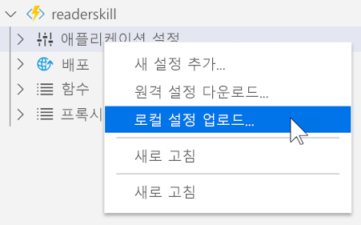
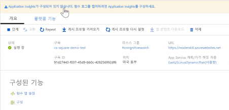

## <a name="demo-3---creating-a-custom-invoice-reader-skill"></a>Demostración 3: Creación de una habilidad de lectura de facturas personalizada

[](https://globaleventcdn.blob.core.windows.net/assets/aiml/aiml10/videos/Demo3.mp4 "Demostración 3")

## <a name="summary"></a>Resumen
En este ejercicio, crearemos una habilidad de Azure Search (en forma de una función de Azure) que toma datos de Azure Search y devuelve un documento JSON estructurado que representa el contenido de la factura en PDF. Para obtener un tratamiento más exhaustivo de la creación de una función de Azure, consulte la [documentación](https://docs.microsoft.com/en-us/azure/azure-functions/functions-create-first-azure-function-azure-cli?WT.mc_id=msignitethetour2019-github-aiml10). Partimos de la base que se ha creado una cuenta de almacenamiento (tal y como se describe en la [primera demostración](demo1.md)), así como el servicio de Form Recognizer (tal y como se describe en la [segunda demostración](demo2.md)).


## <a name="what-you-need"></a>Lo que necesita
- [Conjunto de pruebas de facturas](https://globaleventcdn.blob.core.windows.net/assets/aiml/aiml10/data/test.zip) (se usa para probar la función de Azure)


- [Postman](https://www.getpostman.com/) se utiliza para enviar solicitudes a la API REST del servicio Form Recognizer. Consulte este [manual básico breve](postman.md) para obtener más información.

- [Colección](src/Collections/Reader_Skill.postman_collection.json) de solicitudes de la habilidad de lector de Postman.

- [Azure Functions Core Tools](https://docs.microsoft.com/en-us/azure/azure-functions/functions-run-local?WT.mc_id=msignitethetour2019-github-aiml10#v2)

## <a name="azure-resources"></a>Recursos de Azure
En la tabla siguiente se describen los recursos creados en este ejercicio.

| Nombre                       | Tipo                            | Propósito                    |
| -------------------------- | ------------------------------- | ------------------------- |
| **readerskillstorage**   | Cuenta de almacenamiento              | Almacenamiento usado para la función de Azure |
| **readerskill**          | Function App                 | Aplicación Aptitud cognitiva |
| **readerskill**          | Detalles de la aplicación                   | Agrega información a la aplicación de funciones. |
| **EastUS2LinuxDynamicPlan** | Plan de App Service                   | Plan basado en el consumo para ejecutar la aplicación de funciones (se crea implícitamente) |

## <a name="what-to-do"></a>Lo que debe hacer

Los pasos principales son tres:
1. Ejecución local de la función de Azure `InvoiceReaderSkill`
2. Creación de recursos para admitir la función de Azure `InvoiceReaderSkill`
3. Ejecución de `InvoiceReaderSkill` en Azure

### <a name="run-the-azure-function-locally"></a>Ejecución local de la función de Azure

1. Descargue el código [InvoiceReaderSkill](src/InvoiceReaderSkill) que se encuentra en este repositorio en [Visual Studio Code](https://code.visualstudio.com/) (asegúrese de que las [herramientas de Azure](https://marketplace.visualstudio.com/items?itemName=ms-vscode.vscode-node-azure-pack) están instaladas).

2. Agregue un archivo `local.settings.json` a la carpeta con el siguiente contenido:

```json
{
  "IsEncrypted": false,
  "Values": {
    "FUNCTIONS_WORKER_RUNTIME": "python",
    "AzureWebJobsStorage": "{AzureWebJobsStorage}",
    "FormsRecognizerEndpoint": "<YOUR_FORMS_ENDPOINT>.cognitiveservices.azure.com",
    "FormsRecognizerKey": "<YOUR_FORMS_KEY>",
    "ModelId": "<YOUR_TRAINED_MODEL_ID>"
  }
}
```
3. Ejecute el comando `func host start` para iniciar la función.

4. Importe la [colección](src/Collections/Reader_Skill.postman_collection.json) de solicitudes de la habilidad de lector de Postman a Postman.

5. Abra la solicitud de `Local Forms Skills` y cambie el script solicitado anteriormente para establecer la variable de `storageAccount` en su cuenta de almacenamiento (en el vídeo, la variable es `ttinvoicestorage`) y la variable `SASValue` en la firma de acceso seguro adecuada para el contenedor de `train`. Para obtener información sobre cómo obtener una firma de acceso seguro, consulte esta [breve explicación](sas.md).

```javascript
pm.environment.set('storageAccount', '<YOUR STORAGE ACCOUNT>')
pm.environment.set('container', 'test')
pm.environment.set('SASValue', '<SAS>')
```

6. Compruebe que el URI de `POST` coincida con el de la función de Azure (en nuestra ejecución usamos `http://localhost:7071/api/AnalyzeInvoice`) y haga clic en Enviar. Debe obtener una respuesta similar a la siguiente:


### <a name="create-azure-function-resources"></a>Creación de recursos de Función de Azure

Se supone que los siguientes comandos se ejecutan en el mismo directorio que la función real.

1. Ejecute los siguientes comandos de la CLI de Azure para crear los recursos adecuados y publicar la función:

Creación de almacenamiento de funciones

```
az storage account create --name {FUNCTION_STORAGE} --location {LOCATION} --resource-group {YOUR_RG} --sku Standard_LRS
```

Creación de una aplicación de funciones
```
az functionapp create --resource-group {YOUR_RG} --consumption-plan-location {LOCATION} --name {FUNCTION_NAME} --storage-account {FUNCTION_STORAGE} --runtime python --os-type linux
```
Publicación de una función
```
func azure functionapp publish {FUNCTION_NAME} --build remote
```

2. Use Visual Studio Code para sincronizar la configuración local con la función de Azure; para ello, seleccione el botón Azure, vaya a la función recién creada, haga clic con el botón derecho en `Application Settings` y seleccione `Upload Local Settings` (NOTA: No se puede sobrescribir la base de datos existente).



3. Vaya a la aplicación de funciones recién creada en el portal para agregar Application Insights al servicio.



### <a name="run-the-azure-function-in-the-cloud"></a>Ejecución de la función de Azure en la nube

1. Abra la solicitud de `Cloud Forms Skills` y cambie el script solicitado anteriormente para establecer la variable de `storageAccount` en su cuenta de almacenamiento (en el vídeo, la variable es `ttinvoicestorage`) y la variable `SASValue` en la firma de acceso seguro adecuada para el contenedor de `train`. Para obtener información sobre cómo obtener una firma de acceso seguro, consulte esta [breve explicación](sas.md).

```javascript
pm.environment.set('storageAccount', '<YOUR STORAGE ACCOUNT>')
pm.environment.set('container', 'test')
pm.environment.set('SASValue', '<SAS>')
```

2. Compruebe que el URI de `POST` coincida con el de la función de Azure (debe tener un aspecto similar a `https://<YOUR_ENDPOINT>.azurewebsites.net/api/AnalyzeInvoice`) y haga clic en Enviar. Debe obtener una respuesta similar a la siguiente:


# <a name="next-demo"></a>Siguiente demostración
Obtenga información sobre cómo vincularlo todo y, por último, compile la solución de extremo a extremo pasando a la [Demostración 4: Unión de todos los elementos](demo4.md).
