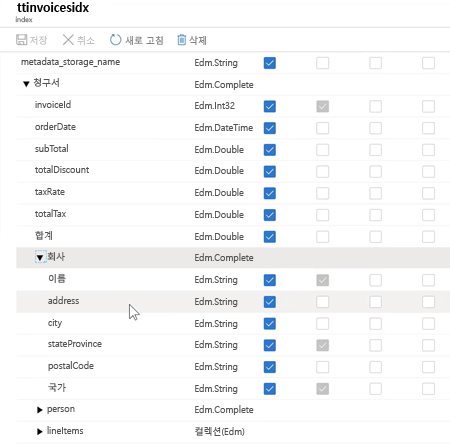
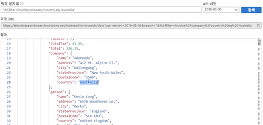

## Demo 4 - Tying it all together

[](https://globaleventcdn.blob.core.windows.net/assets/aiml/aiml10/videos/Demo4.mp4 "Demo 4")

## Summary
In this exercise we tie together all of the resources to create an index, skillset, datasource, and indexer inside of Azure Cognitive Search to exctract Invoice data from our colleciton of pdf files. It is assumed that all of the resources and services from the previous exercises are created and set up properly.


## What you need
- [Invoice Data Set](https://globaleventcdn.blob.core.windows.net/assets/aiml/aiml10/data/invoices_1000.zip) (this is a smaller set of 1000 invoices to run the service and test the functionality)


- [Postman](https://www.getpostman.com/) is used to send requests to the Form Recognizer service REST API. Refer to this [short primer](postman.md) to learn more.

- Postman [Invoice Search Request collection](src/Collections/Invoice_Search.postman_collection.json).

## What to do

There are three main steps:
1. Upload invoices to the storage account
2. Prepare Azure Search Index, Skillset, Datasource, and Indexer
3. Monitor and use Index

### Upload Invoice Data


1. Create a container called `invoices` in the storage account created in the first demo.

[](https://docs.microsoft.com/en-us/azure/storage/blobs/storage-quickstart-blobs-portal?WT.mc_id=msignitethetour2019-github-aiml10 "Create Container")

2. Download and unzip [invoice data set](https://globaleventcdn.blob.core.windows.net/assets/aiml/aiml10/data/invoices_1000.zip).

3. Upload unzipped [invoice data set](https://globaleventcdn.blob.core.windows.net/assets/aiml/aiml10/data/invoices_1000.zip) to the `invoices` container. This can be done directly using the [portal](https://docs.microsoft.com/en-us/azure/storage/blobs/storage-quickstart-blobs-portal?WT.mc_id=msignitethetour2019-github-aiml10#upload-a-block-blob) or by using the [Azure Storage Explorer](https://docs.microsoft.com/en-us/azure/vs-azure-tools-storage-explorer-blobs?WT.mc_id=msignitethetour2019-github-aiml10).

### Prepare Azure Search

This section uses Postman and assumes you know about loading collections, handling variables, and setting pre-request scripts. To learn how to do these specific things we have included some [instructions](postman.md).

| Name                       | Type                            | Purpose                    |
| -------------------------- | ------------------------------- | ------------------------- |
| `api-key`       | Authorization         | Key for Azure Search access  |
| `search_service`       | Variable         | Search service url (without the protocol or slashes)  |
| `index_name`       | Variable         | Name of desired index  |
| `storageConnectionString`       | Variable         | Connection string to storage account containing invoices  |
| `cog_svcs_key`       | Variable         | Key for All-In-One Cognitive Services used in [Demo 1](demo1.md)  |

1. Load the [Invoice Search Request collection](src/Collections/Invoice_Search.postman_collection.json) into Postman.

2. Set all of the variables as described in the table above. Each of these values (with the exception of the `index_name`) can be found in the respective service in the portal. You can choose any `index_name` you like.

3. Open and run the `Create Index` request (using the Send button). This creates the index where the invoice data is stored. After the request successfully completes you should see the changes reflected in the Azure Search service in the portal:



4. Open and run the `Create Skillset` request (using the Send button) - make sure you have updated the forms recognizer endpoint value in the body of this request. This creates our custom skillset the indexer will use to extract the invoice data. This particular skillset only has a single skill (our custom `InvoiceReaderSkill`). As above, if the request completes successfully you should see the new Skillset reflected in the portal.

5. Open and run the `Create Datasource` request (using the Send button). This creates a reference to our storage account where the invoices are located. As above, if the request completes successfully you should see the new Skillset reflected in the portal.

6. Open and run the `Create Indexer` request (using the Send button). This creates the indexer that pulls the invoices from the `Datasource`, uses the `Skillset` on each invoice, and stores the data in the actual `Index`. As above, if the request completes successfully you should see the new Skillset reflected in the portal.


### Monitor and Use Index
The indexer will take some time to go through all of the invoice documents. This can be monitored in the Search Service itself. You can also monitor the calls to the `InvoiceReaderSkill` by looking at the Live Metrics stream in the corresponding App Insights service attached to the Azure Function. Once there are some documents in the index you can run queries to verify it is working:



**Some fun queries to run**:

Orders with ItemId 49
```
*&$filter=invoice/lineItems/any(lineItems: lineItems/itemId eq 49)
```

invoiceId is 12179
```
*&$filter=invoice/invoiceId eq 12179
```

companies in Australia
```
*&$filter=invoice/company/country eq 'Australia'
```

companies in the UK (with a count)
```
*&$count=true&$filter=invoice/company/country eq 'United Kingdom'
```

only retrieve invoices
```
*&$select=invoice&$count=true
```

people in Germany
```
*&$count=true&$select=invoice/person&$filter=invoice/person/country eq 'Germany'
```

# Next Demo
Learn how to explore the Knowledge Store by continuing on to  [Demo 5 - Knowledge Store](demo5.md)
