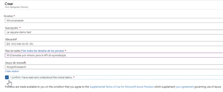

## <a name="demo-2---using-form-recognizer"></a>Demostración 2: Uso de Form Recognizer

[](https://globaleventcdn.blob.core.windows.net/assets/aiml/aiml10/videos/Demo2.mp4 "Demostración 2")

## <a name="summary"></a>Resumen
En este ejercicio aprenderá a usar el servicio Form Recognizer. Partimos de la base que se ha creado una cuenta de almacenamiento (como se describe en la [primera demostración](demo1.md)).


## <a name="what-you-need"></a>Lo que necesita
- [Conjunto de entrenamiento de facturas](https://globaleventcdn.blob.core.windows.net/assets/aiml/aiml10/data/training.zip)

- Acceda a la versión preliminar con acceso limitado. Para acceder a la versión preliminar, rellene y envíe el formulario [Solicitud de acceso de Form Recognizer](https://aka.ms/FormRecognizerRequestAccess).

- [Postman](https://www.getpostman.com/) se utiliza para enviar solicitudes a la API REST del servicio Form Recognizer. Consulte este [manual básico breve](postman.md) para obtener más información.

- [Colección](src/Collections/Form_Recognizer.postman_collection.json) de solicitudes de Form Recognizer de Postman.

## <a name="azure-resources"></a>Recursos de Azure
El único recurso con el que trabajamos en esta demostración es el servicio Form Recognizer.


| Nombre                       | Tipo                            | Propósito                    |
| -------------------------- | ------------------------------- | ------------------------- |
| **ttinvoicereader**       | Servicio Form Recognizer         | Este servicio puede ser que termine en el servicio Todo en uno. Por el momento, ahora está en versión preliminar de acceso limitado. Para acceder a la versión preliminar, rellene y envíe el formulario [Solicitud de acceso de Form Recognizer](https://aka.ms/FormRecognizerRequestAccess).  |


## <a name="what-to-do"></a>Lo que debe hacer

Los pasos principales son tres:
1. Carga de datos de entrenamiento en la cuenta de almacenamiento
2. Creación del servicio Form Recognizer
3. Entrenamiento y uso del servicio Form Recognizer

### <a name="upload-training-data"></a>Carga de los datos de entrenamiento


1. Cree un contenedor denominado `train` en la cuenta de almacenamiento que creó en la demostración anterior.

[](https://docs.microsoft.com/en-us/azure/storage/blobs/storage-quickstart-blobs-portal?WT.mc_id=msignitethetour2019-github-aiml10 "Creación de un contenedor")

2. Descargue y descomprima el [conjunto de entrenamiento de facturas](https://globaleventcdn.blob.core.windows.net/assets/aiml/aiml10/data/training.zip).

3. Cargue el [conjunto de entrenamiento de facturas](https://globaleventcdn.blob.core.windows.net/assets/aiml/aiml10/data/training.zip) descomprimido en el contenedor `train`. Puede realizarlo directamente mediante el [portal](https://docs.microsoft.com/en-us/azure/storage/blobs/storage-quickstart-blobs-portal?WT.mc_id=msignitethetour2019-github-aiml10#upload-a-block-blob) o mediante el [Explorador de Azure Storage](https://docs.microsoft.com/en-us/azure/vs-azure-tools-storage-explorer-blobs?WT.mc_id=msignitethetour2019-github-aiml10) (como se muestra en el [vídeo](https://globaleventcdn.blob.core.windows.net/assets/aiml/aiml10/videos/Demo2.mp4 "Demostración 1")).

### <a name="create-form-recognizer-service"></a>Creación del servicio Form Recognizer

Para ello, debe acceder a la versión preliminar de Form Recognizer. Para acceder a la versión preliminar, rellene y envíe el formulario [Solicitud de acceso de Form Recognizer](https://aka.ms/FormRecognizerRequestAccess). 


[](https://docs.microsoft.com/en-us/azure/cognitive-services/form-recognizer/overview?WT.mc_id=msignitethetour2019-github-aiml10#request-access "Form Recognizer")

### <a name="train-the-form-recognizer-service"></a>Entrenamiento del servicio Form Recognizer

En esta sección se usa Postman y se supone que conoce los conceptos relativos a la carga de colecciones, el control de variables y el establecimiento de scripts previos a la solicitud. Para obtener información sobre cómo realizar estas tareas específicas, hemos incluido algunas [instrucciones](postman.md).

En la tabla siguiente se enumeran las variables establecidas en esta sección del ejercicio:

| Nombre                       | Tipo                            | Propósito                    |
| -------------------------- | ------------------------------- | ------------------------- |
| `Ocp-Apim-Subscription-Key`       | Autorización         | Clave para obtener acceso al servicio Form Recognizer  |
| `endpoint`       | Variable         | Especifica el punto de conexión de Form Recognizer  |
| `modelId`       | Variable         | Modelo actual de Form Recognizer (se establece en el paso 5)  |

1. Cargue la [colección de Form Recognizer](src/Collections/Form_Recognizer.postman_collection.json) en Postman.

2. Establezca el encabezado de autorización `Ocp-Apim-Subscription-Key`, así como la variable `endpoint` en el servicio Form Recognizer (se encuentran en el portal).

3. Abra la solicitud de `TrainModel` y cambie el script solicitado anteriormente para establecer la variable de `storageAccount` en su cuenta de almacenamiento (en el vídeo, la variable es `ttinvoicestorage`) y la variable `SASValue` en la firma de acceso seguro adecuada para el contenedor de `train`. Para obtener información sobre cómo obtener una firma de acceso seguro, consulte esta [breve explicación](sas.md).

```javascript
pm.environment.set('storageAccount', '<YOUR STORAGE ACCOUNT>')
pm.environment.set('container', 'train')
pm.environment.set('SASValue', '<SAS>')
```

4. Presione Enviar en la solicitud. Su respuesta debería ser similar a la siguiente:


5. Establezca la variable de `modelId` para la colección en el `modelId` devuelto indicado anteriormente.


### <a name="use-the-form-recognizer-service"></a>Uso del servicio Form Recognizer

1. Abra la solicitud `AnalyzeForm`. En la sección **Body**, haga clic en el botón `Select Files` para elegir una factura descargada previamente. Después de enviar la solicitud, debería obtener algo similar a:


# <a name="next-demo"></a>Siguiente demostración
Obtenga información sobre cómo crear una habilidad de lectura de facturas personalizada con Azure Functions. Para ello, vaya a la [Demostración 3: Creación de una habilidad de lector de facturas personalizada](demo3.md)
