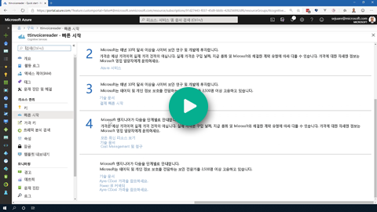
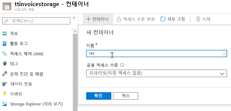
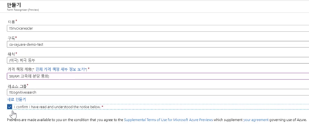
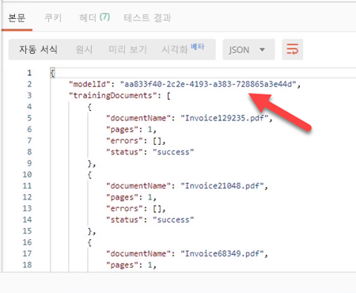
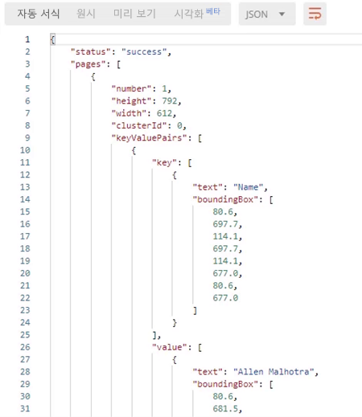

## <a name="demo-2---using-form-recognizer"></a>데모 2 - Form Recognizer 사용

[](https://globaleventcdn.blob.core.windows.net/assets/aiml/aiml10/videos/Demo2.mp4 "데모 2")

## <a name="summary"></a>요약
이 연습에서는 Form Recognizer 서비스를 사용하는 방법을 알아봅니다. [첫 번째 데모](demo1.md)에 설명된 대로 스토리지 계정이 생성된 것으로 가정합니다.


## <a name="what-you-need"></a>필요한 항목
- [청구서 학습 세트](https://globaleventcdn.blob.core.windows.net/assets/aiml/aiml10/data/training.zip)

- 제한된 액세스 미리 보기에 액세스합니다. 미리 보기에 액세스하려면 [Form Recognizer 액세스 요청](https://aka.ms/FormRecognizerRequestAccess) 양식을 작성하여 제출하세요.

- [Postman](https://www.getpostman.com/)은 Form Recognizer 서비스 REST API에 요청을 보내는 데 사용됩니다. 자세한 내용은 이 [간단한 입문](postman.md)을 참조하세요.

- Postman Form Recognizer 요청[컬렉션](src/Collections/Form_Recognizer.postman_collection.json).

## <a name="azure-resources"></a>Azure 리소스
이 데모에서 작업하는 유일한 리소스는 Form Recognizer 서비스입니다.


| 이름                       | 형식                            | 용도                    |
| -------------------------- | ------------------------------- | ------------------------- |
| **ttinvoicereader**       | Form Recognizer Service         | 이 서비스는 최종적으로 올인원 서비스에서 종료됩니다. 지금은 제한된 액세스 미리 보기로 제공됩니다. 미리 보기에 액세스하려면 [Form Recognizer 액세스 요청](https://aka.ms/FormRecognizerRequestAccess) 양식을 작성하여 제출하세요.  |


## <a name="what-to-do"></a>수행할 작업

세 가지 주요 단계가 있습니다.
1. 스토리지 계정에 학습 데이터 업로드
2. Form Recognizer 서비스 만들기
3. Form Recognizer 서비스 학습 및 사용

### <a name="upload-training-data"></a>학습 데이터 업로드


1. 이전 데모에서 만든 스토리지 계정에 `train`이라는 컨테이너를 만듭니다.

[](https://docs.microsoft.com/en-us/azure/storage/blobs/storage-quickstart-blobs-portal?WT.mc_id=msignitethetour2019-github-aiml10 "컨테이너 만들기")

2. [청구서 학습 세트](https://globaleventcdn.blob.core.windows.net/assets/aiml/aiml10/data/training.zip)를 다운로드하고 압축을 풉니다.

3. 압축을 푼 [청구서 학습 세트](https://globaleventcdn.blob.core.windows.net/assets/aiml/aiml10/data/training.zip) `train`를 컨테이너에 업로드합니다. [포털](https://docs.microsoft.com/en-us/azure/storage/blobs/storage-quickstart-blobs-portal?WT.mc_id=msignitethetour2019-github-aiml10#upload-a-block-blob)을 사용하거나 [Azure Storage Explorer](https://docs.microsoft.com/en-us/azure/vs-azure-tools-storage-explorer-blobs?WT.mc_id=msignitethetour2019-github-aiml10)를 사용하여 직접 수행할 수 있습니다([동영상](https://globaleventcdn.blob.core.windows.net/assets/aiml/aiml10/videos/Demo2.mp4 "데모 1")에 표시됨).

### <a name="create-form-recognizer-service"></a>Form Recognizer 서비스 만들기

이 작업을 수행하려면 Form Recognizer 미리 보기에 대한 액세스 권한이 있어야 합니다. 미리 보기에 액세스하려면 [Form Recognizer 액세스 요청](https://aka.ms/FormRecognizerRequestAccess) 양식을 작성하여 제출하세요. 


[](https://docs.microsoft.com/en-us/azure/cognitive-services/form-recognizer/overview?WT.mc_id=msignitethetour2019-github-aiml10#request-access "Form Recognizer")

### <a name="train-the-form-recognizer-service"></a>Form Recognizer 서비스 학습

이 섹션에서는 Postman을 사용하며, 컬렉션을 로드하고 변수를 처리하고 사전 요청 스크립트를 설정하는 방법을 알고 있다고 가정합니다. 이러한 특정 작업을 수행하는 방법을 자세히 알아보기 위해 일부 [지침](postman.md)이 포함되어 있습니다.

아래 표에는 이 연습 섹션에서 설정한 변수가 나와 있습니다.

| 이름                       | 형식                            | 용도                    |
| -------------------------- | ------------------------------- | ------------------------- |
| `Ocp-Apim-Subscription-Key`       | 권한 부여         | Form Recognizer 서비스에 대한 액세스 권한을 얻기 위한 키  |
| `endpoint`       | 변수         | Form Recognizer 엔드포인트를 지정합니다.  |
| `modelId`       | 변수         | 현재 Form Recognizer 모델(5단계에서 설정됨)  |

1. [Form Recognizer 컬렉션](src/Collections/Form_Recognizer.postman_collection.json)을 Postman으로 로드합니다.

2. `Ocp-Apim-Subscription-Key` 권한 부여 헤더 및 `endpoint` 변수를 Form Recognizer 서비스로 설정합니다(포털에서 찾을 수 있음).

3. `TrainModel` 요청을 열고 사전 요청 스크립트를 변경하여 `storageAccount` 변수를 스토리지 계정(동영상에서 변수는 `ttinvoicestorage`)으로 설정하고, `SASValue`를 `train` 컨테이너에 대한 적절한 보안 액세스 서명으로 설정합니다. 보안 액세스 서명을 가져오는 방법에 대한 자세한 내용은 [간단한 설명](sas.md)을 참조하세요.

```javascript
pm.environment.set('storageAccount', '<YOUR STORAGE ACCOUNT>')
pm.environment.set('container', 'train')
pm.environment.set('SASValue', '<SAS>')
```

4. 요청에서 [보내기]를 누릅니다. 응답은 다음과 같습니다.



5. 컬렉션의 `modelId` 변수를 위에 표시된 반환된 `modelId`로 설정합니다.


### <a name="use-the-form-recognizer-service"></a>Form Recognizer 서비스 사용

1. `AnalyzeForm` 요청을 엽니다. **본문** 섹션에서 `Select Files` 단추를 클릭하여 이전에 다운로드한 청구서를 선택합니다. 요청을 보내면 다음과 유사한 항목이 표시됩니다.



# <a name="next-demo"></a>다음 데모
[데모 3 - 사용자 지정 청구서 판독기 기술 만들기](demo3.md)를 계속 진행하여 Azure Functions를 사용해 사용자 지정 청구서 판독기 기술을 만드는 방법을 알아보세요.
