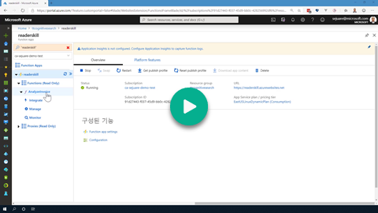

## <a name="demo-3---creating-a-custom-invoice-reader-skill"></a>데모 3 -사용자 지정 청구서 판독기 기술 만들기

[](https://globaleventcdn.blob.core.windows.net/assets/aiml/aiml10/videos/Demo3.mp4 "데모 3")

## <a name="summary"></a>요약
이 연습에서는 Azure Search에서 데이터를 가져오고 pdf 청구서의 콘텐츠를 나타내는 구조화 된 json 문서를 반환하는 Azure Search 기술(Azure 함수 형태)을 만듭니다. Azure 함수 만들기의 심층 처리를 자세히 알아보려면 [문서](https://docs.microsoft.com/en-us/azure/azure-functions/functions-create-first-azure-function-azure-cli?WT.mc_id=msignitethetour2019-github-aiml10)를 참조하세요. ([첫 번째 데모](demo1.md)뿐 아니라 [두 번째 데모](demo2.md)에 만든 Form Recognizer 서비스에 설명된 대로) 스토리지 계정이 만들어졌다고 가정합니다.


## <a name="what-you-need"></a>필요한 항목
- [청구서 테스트 세트](https://globaleventcdn.blob.core.windows.net/assets/aiml/aiml10/data/test.zip)(Azure 함수를 테스트하는 데 사용됨)


- [Postman](https://www.getpostman.com/)은 Form Recognizer 서비스 REST API에 요청을 보내는 데 사용됩니다. 자세한 내용은 이 [간단한 입문](postman.md)을 참조하세요.

- Postman Reader 기술 요청 [컬렉션](src/Collections/Reader_Skill.postman_collection.json)입니다.

- [Azure Functions 핵심 도구](https://docs.microsoft.com/en-us/azure/azure-functions/functions-run-local?WT.mc_id=msignitethetour2019-github-aiml10#v2)

## <a name="azure-resources"></a>Azure 리소스
아래 표에서는 이 연습에서 만든 리소스에 대해 설명합니다.

| 이름                       | 형식                            | 용도                    |
| -------------------------- | ------------------------------- | ------------------------- |
| **readerskillstorage**   | 스토리지 계정              | Azure 함수에 사용되는 스토리지 |
| **readerskill**          | 함수 앱                 | 인식 기술 앱 |
| **readerskill**          | App Insights                   | 함수 앱에 인사이트를 추가합니다. |
| **EastUS2LinuxDynamicPlan** | App Service 계획                   | 함수 앱을 실행하기 위한 소비 기반 계획입니다(암시적으로 생성됨). |

## <a name="what-to-do"></a>수행할 작업

세 가지 주요 단계가 있습니다.
1. 로컬에서 `InvoiceReaderSkill` Azure 함수 실행
2. `InvoiceReaderSkill` Azure 함수를 지원하는 리소스 만들기
3. Azure에서 `InvoiceReaderSkill` 실행

### <a name="run-the-azure-function-locally"></a>로컬에서 Azure 함수 실행

1. [Visual Studio Code](https://code.visualstudio.com/)에서 이 리포지토리에 있는 [InvoiceReaderSkill](src/InvoiceReaderSkill) 코드를 다운로드합니다([Azure Tools](https://marketplace.visualstudio.com/items?itemName=ms-vscode.vscode-node-azure-pack)가 설치되어 있어야 함).

2. 다음 콘텐츠를 사용하여 폴더에 `local.settings.json` 파일을 추가합니다.

```json
{
  "IsEncrypted": false,
  "Values": {
    "FUNCTIONS_WORKER_RUNTIME": "python",
    "AzureWebJobsStorage": "{AzureWebJobsStorage}",
    "FormsRecognizerEndpoint": "<YOUR_FORMS_ENDPOINT>.cognitiveservices.azure.com",
    "FormsRecognizerKey": "<YOUR_FORMS_KEY>",
    "ModelId": "<YOUR_TRAINED_MODEL_ID>"
  }
}
```
3. 다음 `func host start` 명령을 실행하여 함수를 시작합니다.

4. Postman Reader 기술 요청 [컬렉션](src/Collections/Reader_Skill.postman_collection.json)을 Postman으로 가져옵니다.

5. `Local Forms Skills` 요청을 열고 사전 요청 스크립트를 변경하여 `storageAccount` 변수를 스토리지 계정(동영상에서 변수는 `ttinvoicestorage`)으로 설정하고, `SASValue`를 `train` 컨테이너에 대한 적절한 보안 액세스 서명으로 설정합니다. 보안 액세스 서명을 가져오는 방법에 대한 자세한 내용은 [간단한 설명](sas.md)을 참조하세요.

```javascript
pm.environment.set('storageAccount', '<YOUR STORAGE ACCOUNT>')
pm.environment.set('container', 'test')
pm.environment.set('SASValue', '<SAS>')
```

6. `POST` URI가 Azure 함수(`http://localhost:7071/api/AnalyzeInvoice`를 사용하는 해당 함수 실행 시) 중 하나와 일치하는지 확인하고 [보내기]를 클릭합니다. 다음과 유사한 응답이 표시됩니다.


### <a name="create-azure-function-resources"></a>Azure 함수 리소스 만들기

다음 명령은 실제 함수와 동일한 디렉터리에서 실행되는 것으로 가정합니다.

1. 다음 Azure CLI 명령을 실행하여 적절한 리소스를 만들고 함수를 게시합니다.

함수 스토리지 만들기

```
az storage account create --name {FUNCTION_STORAGE} --location {LOCATION} --resource-group {YOUR_RG} --sku Standard_LRS
```

함수 앱 만들기
```
az functionapp create --resource-group {YOUR_RG} --consumption-plan-location {LOCATION} --name {FUNCTION_NAME} --storage-account {FUNCTION_STORAGE} --runtime python --os-type linux
```
함수 게시
```
func azure functionapp publish {FUNCTION_NAME} --build remote
```

2. Visual Studio Code를 사용하여 Azure 단추를 선택하고 새로 만든 함수로 이동한 후, `Application Settings`를 마우스 오른쪽 단추로 클릭하고 `Upload Local Settings`를 선택하여 로컬 설정을 Azure 함수에 동기화합니다(참고: 기존 변수를 덮어쓰지 않음).


3. 포털에서 새로 만든 함수 앱으로 이동하여 서비스에 Application Insights를 추가합니다.


### <a name="run-the-azure-function-in-the-cloud"></a>클라우드에서 Azure 함수 실행

1. `Cloud Forms Skills` 요청을 열고 사전 요청 스크립트를 변경하여 `storageAccount` 변수를 스토리지 계정(동영상에서 변수는 `ttinvoicestorage`)으로 설정하고, `SASValue`를 `train` 컨테이너에 대한 적절한 보안 액세스 서명으로 설정합니다. 보안 액세스 서명을 가져오는 방법에 대한 자세한 내용은 [간단한 설명](sas.md)을 참조하세요.

```javascript
pm.environment.set('storageAccount', '<YOUR STORAGE ACCOUNT>')
pm.environment.set('container', 'test')
pm.environment.set('SASValue', '<SAS>')
```

2. `POST` URI가 Azure 함수(`https://<YOUR_ENDPOINT>.azurewebsites.net/api/AnalyzeInvoice`처럼 보여야 함) 중 하나와 일치하는지 확인하고 [보내기]를 클릭합니다. 다음과 유사한 응답이 표시됩니다.


# <a name="next-demo"></a>다음 데모
[데모 4 - 모든 항목 요약](demo4.md)을 계속 진행하여 모든 것을 함께 연결하는 방법을 알아보고 엔드투엔드 솔루션을 빌드합니다.
