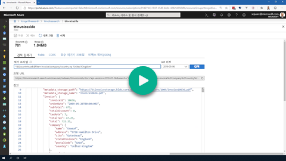

## <a name="demo-4---tying-it-all-together"></a>데모 4 - 모든 항목 요약

[](https://globaleventcdn.blob.core.windows.net/assets/aiml/aiml10/videos/Demo4.mp4 "데모 4")

## <a name="summary"></a>요약
이 연습에서는 모든 리소스를 요약하여 Azure Cognitive Search 내에서 인덱스, 기술 세트, 데이터 원본 및 인덱서를 만들어 PDF 파일 컬렉션에서 청구서 데이터를 추출합니다. 이전 연습에서 모든 리소스와 서비스를 올바르게 만들고 설정한 것으로 가정합니다.


## <a name="what-you-need"></a>필요한 항목
- [청구서 데이터 세트](https://globaleventcdn.blob.core.windows.net/assets/aiml/aiml10/data/invoices_1000.zip)(서비스를 실행하고 기능을 테스트하기 위한 청구서 1,000개의 작은 집합임)


- [Postman](https://www.getpostman.com/)은 Form Recognizer 서비스 REST API에 요청을 보내는 데 사용됩니다. 자세한 내용은 이 [간단한 입문서](postman.md)를 참조하세요.

- Postman [청구서 검색 요청 컬렉션](src/Collections/Invoice_Search.postman_collection.json).

## <a name="what-to-do"></a>수행할 작업

세 가지 주요 단계가 있습니다.
1. 스토리지 계정에 청구서 업로드
2. Azure Search Index, 기술 세트, 데이터 원본 및 인덱서 준비
3. 인덱스 모니터링 및 사용

### <a name="upload-invoice-data"></a>청구서 데이터 업로드


1. 첫 번째 데모에서 만든 스토리지 계정에 `invoices`라는 컨테이너를 만듭니다.

[](https://docs.microsoft.com/en-us/azure/storage/blobs/storage-quickstart-blobs-portal?WT.mc_id=msignitethetour2019-github-aiml10 "컨테이너 만들기")

2. [청구서 데이터 세트](https://globaleventcdn.blob.core.windows.net/assets/aiml/aiml10/data/invoices_1000.zip)를 다운로드하고 압축을 풉니다.

3. 압축을 푼 [청구서 데이터 세트](https://globaleventcdn.blob.core.windows.net/assets/aiml/aiml10/data/invoices_1000.zip)를 `invoices` 컨테이너에 업로드합니다. [포털](https://docs.microsoft.com/en-us/azure/storage/blobs/storage-quickstart-blobs-portal?WT.mc_id=msignitethetour2019-github-aiml10#upload-a-block-blob)을 사용하거나 [Azure Storage Explorer](https://docs.microsoft.com/en-us/azure/vs-azure-tools-storage-explorer-blobs?WT.mc_id=msignitethetour2019-github-aiml10)를 사용하여 직접 수행할 수 있습니다.

### <a name="prepare-azure-search"></a>Azure Search 준비

이 섹션에서는 Postman을 사용하며, 컬렉션을 로드하고 변수를 처리하고 사전 요청 스크립트를 설정하는 방법을 알고 있다고 가정합니다. 이러한 특정 작업을 수행하는 방법을 자세히 알아보기 위해 일부 [지침](postman.md)이 포함되어 있습니다.

| 이름                       | 형식                            | 용도                    |
| -------------------------- | ------------------------------- | ------------------------- |
| `api-key`       | 권한 부여         | Azure Search 액세스용 키  |
| `search_service`       | 변수         | 검색 서비스 URL(프로토콜 또는 슬래시 제외)  |
| `index_name`       | 변수         | 원하는 인덱스의 이름  |
| `storageConnectionString`       | 변수         | 청구서가 포함된 스토리지 계정에 대한 연결 문자열  |
| `cog_svcs_key`       | 변수         | [데모 1](demo1.md)에서 사용되는 올인원 Cognitive Services용 키  |

1. [청구서 검색 요청 컬렉션](src/Collections/Invoice_Search.postman_collection.json)을 Postman에 로드합니다.

2. 위의 표에 설명된 대로 모든 변수를 설정합니다. 이러한 각 값(`index_name`의 예외 포함)은 포털의 각 서비스에서 찾을 수 있습니다. 원하는 `index_name`을 선택할 수 있습니다.

3. 보내기 단추를 사용하여 `Create Index` 요청을 열고 실행합니다. 그러면 청구서 데이터가 저장되는 인덱스가 생성됩니다. 요청이 성공적으로 완료되면 포털에서 Azure Search 서비스에 반영된 변경 내용이 표시됩니다.


4. 보내기 단추를 사용하여 `Create Skillset` 요청을 열고 실행합니다. 그러면 인덱서가 청구서 데이터를 추출하는 데 사용할 사용자 지정 기술 세트가 생성됩니다. 이 특정 기술 세트에는 단일 기술(사용자 지정 `InvoiceReaderSkill`)만 있습니다. 위와 같이 요청이 성공적으로 완료되면 새 기술 세트가 포털에 반영된 것을 볼 수 있습니다.

5. 보내기 단추를 사용하여 `Create Datasource` 요청을 열고 실행합니다. 그러면 청구서가 있는 스토리지 계정에 대한 참조가 생성됩니다. 위와 같이 요청이 성공적으로 완료되면 새 기술 세트가 포털에 반영된 것을 볼 수 있습니다.

6. 보내기 단추를 사용하여 `Create Indexer` 요청을 열고 실행합니다. 그러면 `Datasource`에서 청구서를 가져오는 인덱서가 생성되고 각 청구서에 `Skillset`가 사용되며 데이터가 실제 `Index`에 저장됩니다. 위와 같이 요청이 성공적으로 완료되면 새 기술 세트가 포털에 반영된 것을 볼 수 있습니다.


### <a name="monitor-and-use-index"></a>인덱스 모니터링 및 사용
인덱서가 모든 청구서 문서를 처리하는 데는 약간의 시간이 걸립니다. Search Service 자체에서 모니터링할 수 있습니다. 또한 Azure Function에 연결된 해당 App Insights 서비스에서 라이브 메트릭 스트림을 살펴보면 `InvoiceReaderSkill`에 대한 호출을 모니터링할 수 있습니다. 인덱스에 일부 문서가 있으면 쿼리를 실행하여 작동하는지 확인할 수 있습니다.


**실행할 몇 가지 흥미로운 쿼리**:

ItemId 49로 주문
```
*&$filter=invoice/lineItems/any(lineItems: lineItems/itemId eq 49)
```

invoiceId는 12179
```
*&$filter=invoice/invoiceId eq 12179
```

호주의 회사
```
*&$filter=invoice/company/country eq 'Australia'
```

영국의 회사(개수 포함)
```
*&$count=true&$filter=invoice/company/country eq 'United Kingdom'
```

청구서만 검색
```
*&$select=invoice&$count=true
```

독일에 있는 사람들
```
*&$count=true&$select=invoice/person&$filter=invoice/person/country eq 'Germany'
```

# <a name="next-demo"></a>다음 데모
[데모 5 - 지식 저장소](demo5.md)로 계속 진행하여 기술 저장소를 탐색하는 방법을 알아보세요.